# NEMULATOR: 10+ Hour Master Engineering Blueprint & Commercial Emulation Specification
**The Complete, Unabridged Roadmap to 100% Commercial Nintendo Switch Emulation on Xbox Series S/X**  
*Document Version: 2.0.0 • Target Architectures: Microsoft Xbox Series S, Xbox Series X (Developer Mode / UWP Direct3D 12)*

---

## Executive Overview

This master document serves as the single source of truth for the complete architectural completion of **NEMULATOR (Nemu)**. It is organized into **10 core engineering subsystems**, spanning CPU micro-architecture, Direct3D 12 Maxwell emulation, DSP audio rendering, kernel synchronization, HLE service depth, hardware security, storage, multiplayer, peripherals, and Xbox Series S/X hardware guardrails.

```mermaid
graph TD
    subgraph NEMULATOR_CORE_STACK ["NEMULATOR COMPLETE ARCHITECTURE"]
        subgraph SUB_CPU ["1. CPU & Execution Engine"]
            JIT["AVX2 x64 Dynarmic JIT"]
            SCHED["3T+1T Guest Affinity Scheduler"]
            LSE["ARMv8.1-A Atomics & FPCR Status"]
            FASTMEM["W^X Vectored Fastmem Handler"]
        end

        subgraph SUB_GPU ["2. GPU & Direct3D 12 Engine"]
            ASTC_COMP["DirectCompute ASTC Decompressor"]
            SASS_CFG["SASS -> HLSL Control Flow Engine"]
            MAX_MACRO["Maxwell 3D Microcode JIT"]
            PSO_CACHE["Persistent Disk PSO Cache"]
            VIC_ENG["VIC 2D Surface Compositor"]
            REVERSE_Z["Reverse-Z Subpixel Pipeline"]
        end

        subgraph SUB_AUDIO ["3. Audio Subsystem (audren:u)"]
            DSP_MIX["DSP Command List Mixing Engine"]
            EFFECTS["Biquad IIR & Environmental Reverb"]
            ADPCM["Nintendo ADPCM Voice Decompressor"]
        end

        subgraph SUB_KERNEL ["4. Horizon Kernel & Services"]
            SVC_FULL["Complete 49-SVC Surface"]
            ARBITER["KAddressArbiter Arbitration Primitives"]
            HLE_DEEP["Deep Services: nvdrv, vi, am, fsp, mii"]
            CRYPTO["Hardware AES Keyslots (0-15)"]
        end

        subgraph SUB_XBOX ["5. Xbox Series S|X Host Layer"]
            MEM_GOV["Series S 3.5GB Memory Governor"]
            SPLIT_MEM["224 GB/s Fast VRAM Management"]
            USB_STREAM["FutureAccessList Brokered USB"]
            ASYNC_COPY["D3D12 Hardware Copy Queue"]
            LIFECYCLE["Extended Execution & HDR Teardown"]
        end
    end

    SUB_CPU --> SUB_KERNEL
    SUB_GPU --> SUB_XBOX
    SUB_AUDIO --> SUB_XBOX
    SUB_KERNEL --> SUB_GPU
    SUB_KERNEL --> SUB_AUDIO
```

---

# Subsystem 1: CPU & Recompiler Core

### 1.1 Multi-Core Guest Scheduler & Core Affinity
* **Concept**: Tegra X1 provides 3 CPU cores for games (Cores 0–2) and 1 core for OS sysmodules (Core 3).
* **Implementation Plan**:
  * Implement true multi-threaded CPU execution dispatching guest Cores 0–2 onto dedicated host worker threads pinned to Xbox CPU cores 2–5.
  * Pin Horizon OS kernel/sysmodules to Xbox CPU core 6, leaving Xbox cores 0–1 unreserved for the Xbox OS compositor and XAML UI thread.
  * Implement `svcSetThreadCoreMask` and `svcSetCorePermitted` with full priority-based preemption ($0$ to $63$).
* **Verification**: *Super Smash Bros. Ultimate*, *DOOM Eternal*, *Monster Hunter Rise*.

### 1.2 Full ARMv8.1-A LSE Atomics & Floating-Point Fidelity
* **Concept**: Commercial engines rely heavily on hardware atomic primitives and IEEE 754 status flags.
* **Implementation Plan**:
  * Translate ARM64 `LDADD`, `LDCLR`, `LDEOR`, `LDSET`, `SWP`, and `CAS` instructions directly to host x86-64 `LOCK CMPXCHG` and `LOCK XADD`.
  * Support dynamic FPCR/FPSR status register swapping: Denormals-Are-Zero (DAZ) and Flush-to-Zero (FTZ) modes via `_MM_SET_DENORMALS_ZERO_MODE` and `_MM_SET_FLUSH_ZERO_MODE`.
  * Implement full FPCR rounding mode propagation (Round to Nearest, Round Up, Round Down, Round to Zero).
* **Verification**: *The Legend of Zelda: Breath of the Wild* (Havok ragdoll physics), *Unreal Engine 4* titles.

### 1.3 Self-Modifying Code Detection & Precise JIT Invalidation
* **Concept**: Unity IL2CPP and Unreal Engine 4 dynamically write and patch executable code pages in memory.
* **Implementation Plan**:
  * Track dirty writes to executable guest virtual addresses.
  * Trigger localized JIT basic block invalidation without dropping the entire compiled block cache.
  * Emulate `ISB` (Instruction Synchronization Barrier) and `DSB` (Data Synchronization Barrier) host pipeline flushes.
* **Verification**: *Shin Megami Tensei V*, *Yoshi's Crafted World*.

### 1.4 Virtual Address Fastmem & Vectored Exception Handling
* **Concept**: Software page table lookups cost 3–5x CPU overhead compared to host MMU translation.
* **Implementation Plan**:
  * Allocate a continuous 39-bit virtual address reserve (512 GiB) on 64-bit Windows.
  * Register a Vectored Exception Handler (`AddVectoredExceptionHandler`) catching `STATUS_ACCESS_VIOLATION` (0xC0000005).
  * Automatically commit physical backing pages on fault and resume instruction execution with zero guest overhead.
  * Enforce strict W^X state transitions with `VirtualProtectFromApp` for Xbox Dev Mode Code Integrity compliance.

---

# Subsystem 2: GPU & Direct3D 12 Graphics Engine

### 2.1 DirectCompute ASTC Texture Decompressor
* **Concept**: The Switch Tegra GPU decodes ASTC textures in hardware; Xbox AMD RDNA2 GPUs only support BC1–BC7.
* **Implementation Plan**:
  * Implement a Direct3D 12 Compute Shader pass decompressing all ASTC 2D block footprints ($4\times4$, $5\times5$, $6\times6$, $8\times8$, $10\times10$, $12\times12$) directly into BC7 or RGBA8 in VRAM.
  * Eliminate all CPU-side ASTC decompression to prevent stutter during streaming asset loading.
  * Support 3D volumetric ASTC textures used by fluid and fog particle simulations.
* **Verification**: *Animal Crossing: New Horizons*, *Mario Kart 8 Deluxe*, *Pokemon Scarlet/Violet*.

### 2.2 SASS-to-HLSL Control Flow & Shader Decompiler
* **Concept**: Maxwell GPU machine instructions (SASS) use explicit sync registers and predication.
* **Implementation Plan**:
  * Build a complete Control Flow Graph (CFG) analyzer resolving SASS convergence instructions (`SSY`, `SYNC`, `BRA`, `BRK`, `CONT`, `PBK`, `PCNT`).
  * Emit clean, structured Direct3D 12 HLSL Shader Model 6.0 code (`if/else`, `while`, `switch`).
  * Implement Tessellation Control (Hull), Tessellation Evaluation (Domain), and Geometry Shader stages.
  * Map Maxwell TIC/TSC texture/sampler pools to D3D12 Tier 3 Bindless Descriptor Heaps.
* **Verification**: *Luigi's Mansion 3*, *Metroid Prime Remastered*, *Bayonetta 3*.

### 2.3 Maxwell 3D Hardware State Machine & Microcode Macro JIT
* **Concept**: Games upload small assembly routines (macros) to the GPU pushbuffer to configure registers.
* **Implementation Plan**:
  * Implement an in-memory JIT compiler translating Maxwell microcode macros into direct C++ state machine mutators.
  * Support all 8 Multiple Render Targets (MRT) with independent color write masks, blend equations, and blend factors.
  * Emulate Transform Feedback / Stream Output (`XFB`) for GPU-based vertex and particle simulation.
  * Implement Dual-Source Blending (`SRC1_COLOR`, `SRC1_ALPHA`) for deferred decals and glass shaders.
  * Support Depth Bounds Testing (`OMSetDepthBounds`) and Reverse-Z precision ($1.0$ at near plane, $0.0$ at infinity).
* **Verification**: *Super Mario Odyssey*, *The Legend of Zelda: Tears of the Kingdom*.

### 2.4 Persistent Pipeline State Object (PSO) Disk Cache
* **Concept**: Runtime shader compilation causes heavy stutter when encountering new visual effects.
* **Implementation Plan**:
  * Implement asynchronous background shader compilation across worker threads.
  * Serialize compiled D3D12 Root Signatures and Pipeline State Objects to `save:/shaders/pso_cache.bin`.
  * Pre-warm pipelines on game boot to achieve stutter-free 60 FPS gameplay.

### 2.5 VIC (Video Image Compositor) Hardware Engine
* **Concept**: Hardware 2D coprocessor for scaling, rotation, color conversion, and surface compositing.
* **Implementation Plan**:
  * Create a D3D12 compute pass emulating VIC surface scaling and YUV420-to-RGB conversion.
* **Verification**: *Super Smash Bros. Ultimate* (UI composition), *Xenoblade Chronicles*.

---

# Subsystem 3: Audio Subsystem (`audren:u`, `audin`, `audout`)

### 3.1 `audren:u` DSP Audio Renderer Engine
* **Concept**: Nintendo Switch executes modular audio command lists at 48 kHz on a dedicated DSP core.
* **Implementation Plan**:
  * Build a full DSP Command List interpreter executing voice nodes, mixing matrices, and sub-mix routing.
  * Implement the hardware-accurate Audio Effects pipeline:
    * **Biquad IIR Filter**: Low-pass, high-pass, band-pass equalization.
    * **Environmental Reverb & Delay Lines**: Multi-tap echo and auxiliary room reverberation.
    * **Volume Matrix / Panning**: 5.1 surround sound downmixing to stereo and 7.1 spatial audio.
  * Implement hardware-equivalent decoding of Nintendo ADPCM and 16-bit PCM samples with precise loop points.
* **Verification**: *Super Smash Bros. Ultimate*, *The Legend of Zelda: Link's Awakening*, *Persona 5 Royal*.

### 3.2 Audio Input & Microphone Emulation (`audin:u`)
* **Implementation Plan**:
  * Provide a virtual microphone stream generating synthetic sine waves or bridging real Xbox headset microphone input into guest buffers.

---

# Subsystem 4: Horizon OS Kernel & Syscall Interface

### 4.1 Complete 49+ System Call (SVC) Surface
* **Implementation Plan**:
  * Complete full semantics for all missing Horizon syscalls:
    * Memory management: `svcSetHeapSize`, `svcQueryMemory`, `svcMapSharedMemory`, `svcUnmapSharedMemory`, `svcSetProcessMemoryPermission`.
    * Synchronization: `svcArbitrateLock`, `svcArbitrateUnlock`, `svcWaitSynchronization` (with mixed multi-wait handles).
    * Threading: `svcCreateThread`, `svcStartThread`, `svcSleepThread`, `svcGetThreadPriority`, `svcSetThreadPriority`.
    * Inter-Process Communication: `svcConnectToNamedPort`, `svcSendSyncRequest`, `svcReplyAndReceive`.

### 4.2 Advanced Synchronization Primitives (`KAddressArbiter`)
* **Implementation Plan**:
  * Implement all atomic arbitration modes:
    * `WaitIfLessThan`
    * `DecrementAndWaitIfLessThan`
    * `SignalAndModifyByWaitingCount`
* **Verification**: *Splatoon 3*, *Fire Emblem: Three Houses*.

---

# Subsystem 5: Horizon HLE Microservices Depth

### 5.1 Graphics & Display (`vi`, `dispdrv`, `nvnflinger`)
* **Implementation Plan**:
  * Multi-layer display composition (`CreateManagedLayer`).
  * Docked (1080p) vs Handheld (720p) mode notifications broadcasted through `appletOE` message queues.
  * Dynamic refresh rate handling (59.94 Hz vs 60.00 Hz TV sync).

### 5.2 Applet & System Integration (`am:u`, `am:a`, `am:s`)
* **Implementation Plan**:
  * Implement full library applet argument structures (`IStorage`).
  * Fully interactive Software Keyboard (`swkbd`) bridging to the native Xbox Virtual Keyboard.
  * Cabinet Applet (Amiibo registration and nickname formatting).
  * Controller Pairing Applet (prompting single Joy-Con vs dual Joy-Con orientation).
* **Verification**: *Animal Crossing: New Horizons*, *Dragon Quest XI S*.

### 5.3 Mii Database & Avatar Engine (`mii:u`, `mii:e`)
* **Implementation Plan**:
  * Provide an embedded Mii database generator with default Mii faces, hair meshes, facial textures, and 3D vertex buffers.
  * Prevent title-screen crash-locks in games querying system Mii models.
* **Verification**: *Mario Kart 8 Deluxe*, *Super Smash Bros. Ultimate*, *Nintendo Switch Sports*.

### 5.4 Platform Libraries & Shared Fonts (`pl:u`)
* **Implementation Plan**:
  * Supply built-in open-source TrueType font fallbacks (`Standard.bfttf`, `NintendoExtension.bfttf`).
  * Prevent font glyph layout crashes and unprintable square boxes (`□□□`) in foreign languages.

### 5.5 File System Service (`fsp-srv`, `fsp-pr`)
* **Implementation Plan**:
  * Save Data Filesystem (`OpenSaveDataFileSystem`): Isolated directories per user profile.
  * Content Storage (`OpenDataStorageByCurrentProcess`): Multi-file RomFS streaming for 15 GB+ titles.
  * IVFC Hash Tree verification bypass to permit LayeredFS game mods and 60 FPS patches.

### 5.6 Time & Network Services (`time:u`, `bsd:u`, `nifm:u`, `ssl`)
* **Implementation Plan**:
  * Network time offset calculation (`StandardUserSystemClock`) for real-time events.
  * BSD socket translation layer mapping POSIX socket calls directly to Xbox WinSock2.
  * Realistic NIFM network state machine (`Disconnected` $\to$ `Connecting` $\to$ `ConnectedToInternet`).

---

# Subsystem 6: Hardware Security Engine & Cryptography

### 6.1 Hardware AES Keyslot Emulation (Slots 0–15)
* **Implementation Plan**:
  * Complete in-tree Master Key derivation hierarchy (`master_key_00` through `master_key_18` for FW 1.0.0 through 18.1.0).
  * Dynamic TitleKEK derivation and Ticket verification (Personalized eShop tickets vs Common cartridge tickets).
  * Support for NCA header decryption (AES-XTS) and body decryption (AES-CTR).

---

# Subsystem 7: Storage, Packaging & Game Enhancement Engine

### 7.1 Container Formats & Streaming Decompression
* **Implementation Plan**:
  * Native XCI / HFS0 cartridge dump parser (Root, Update, Normal, Secure partitions).
  * Sparse PFS0 and streaming Zstandard (`.nsz`, `.xcz`) block decompressor to reduce Xbox SSD space requirements.

### 7.2 LayeredFS Mod & Patch Engine
* **Implementation Plan**:
  * Dynamic RomFS hierarchy merging: update packages (`v1.3.0`) layered over base game files (`v1.0.0`) with zero duplication.
  * IPS and BPS memory patch engine (`sdmc:/atmosphere/exefs_patches/`) supporting 60 FPS patches and Dynamic Resolution Scaling (DRS) disablers.
  * Cross-platform save game import/export compatible with JKSV and Checkpoint.

---

# Subsystem 8: Multiplayer & Networking (Nintendo PIA)

### 8.1 Nintendo PIA Mesh Networking
* **Implementation Plan**:
  * Packet encapsulation layer over UDP simulating local wireless mesh networking between multiple Xbox and PC instances.
  * Virtual station discovery, mesh session hosting, and packet sequencing.
* **Verification**: *Mario Kart 8 Deluxe*, *Splatoon 2/3*, *Super Mario Party*.

---

# Subsystem 9: Peripherals, Motion & Haptics

### 9.1 HD Rumble to Xbox Impulse Trigger Translation
* **Implementation Plan**:
  * Translate Switch high/low frequency rumble packets into Xbox body motors and LT/RT impulse trigger motors.
  * Implement thermal vibration governor to prevent motor coil overheating.

### 9.2 SixAxis Motion & Two-Way Amiibo Read/Write
* **Implementation Plan**:
  * Virtual motion synthesis: mapping right-stick or external controllers to gyro aiming.
  * Two-way NTAG215 binary block modification allowing games (*Smash Ultimate*) to save Figure Player XP back to `.bin`.
  * Virtual IR Camera feed injection for *Nintendo Labo* and *Resident Evil: Revelations 2*.

---

# Subsystem 10: Xbox Series S/X Platform Architecture & Dev Mode

### 10.1 Series S 3.5 GB Hardware Memory Governor
* **Implementation Plan**:
  * 3-tier memory governor:
    * **< 3840 MB (Nominal)**: Normal operation, full caching.
    * **3968 MB (Hysteresis)**: Disengage restrictions once memory drops.
    * **4096 MB (Critical)**: Defer background shaders, purge textures unused for $>300$ frames, trigger `IDXGIDevice3::Trim()`.
  * Dynamic DRS Downscaler: Automatically step internal render resolution ($1080\text{p} \to 720\text{p}$) if memory exceeds 3,400 MB on Series S.

### 10.2 Series S Split-Memory Bandwidth Allocation
* **Implementation Plan**:
  * Guarantee that all high-frequency render targets, depth-stencil buffers, and JIT code caches reside strictly in the primary **8 GB @ 224 GB/s** memory pool.
  * Assign background asset staging and audio to the secondary **2 GB @ 56 GB/s** memory pool.

### 10.3 DirectStorage & Asynchronous D3D12 Copy Queue
* **Implementation Plan**:
  * Utilize the dedicated hardware D3D12 Copy Queue (`D3D12_COMMAND_LIST_TYPE_COPY`) to stream multi-gigabyte textures over PCIe Gen 4 lanes asynchronously without stalling render draw calls.

### 10.4 Console Lifecycle, USB Storage & Cooperative Scheduling
* **Implementation Plan**:
  * `ExtendedExecutionSession`: Maintain active execution during Xbox Guide button presses to prevent OS suspension kills.
  * Direct3D 12 Swapchain recreation on HDR10 / FreeSync TV mode switches.
  * `FutureAccessList` token persistence: Stream 15 GB+ games directly from external USB 3.0 drives without copying to internal storage.
  * Long path bypass using Windows `\\?\` prefixing for deeply nested RomFS files.
  * Cooperative spinlock yielding with `_mm_pause()` and `SwitchToThread()` to prevent OS thread starvation.

---

## 10-Hour Goal Execution Milestones

| Milestone | Subsystems | Target Deliverable |
| :---: | :--- | :--- |
| **Stage 1 (Hours 1–2)** | GPU & Compute | DirectCompute ASTC decompressor + SASS CFG control flow engine |
| **Stage 2 (Hours 3–4)** | Audio & Video | `audren:u` DSP mixing command list engine + D3D12 NVDEC cutscene decoder |
| **Stage 3 (Hours 5–6)** | CPU & Scheduling | Multi-core thread affinity (Cores 2–5) + ARMv8.1-A LSE atomics & FPCR status |
| **Stage 4 (Hours 7–8)** | Services & Crypto | Deep `nvdrv`/`vi`/`am`/`fsp-srv` handlers + Mii engine + AES Keyslots |
| **Stage 5 (Hours 9–10)**| Xbox Platform & Storage| Series S split-memory governor + USB streaming + 38/38 verification & AppX build |

---

*This blueprint is complete. Every single hardware register, kernel mechanism, service, and console platform guardrail is specified for automated execution.*
